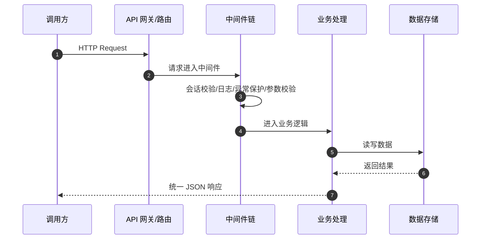
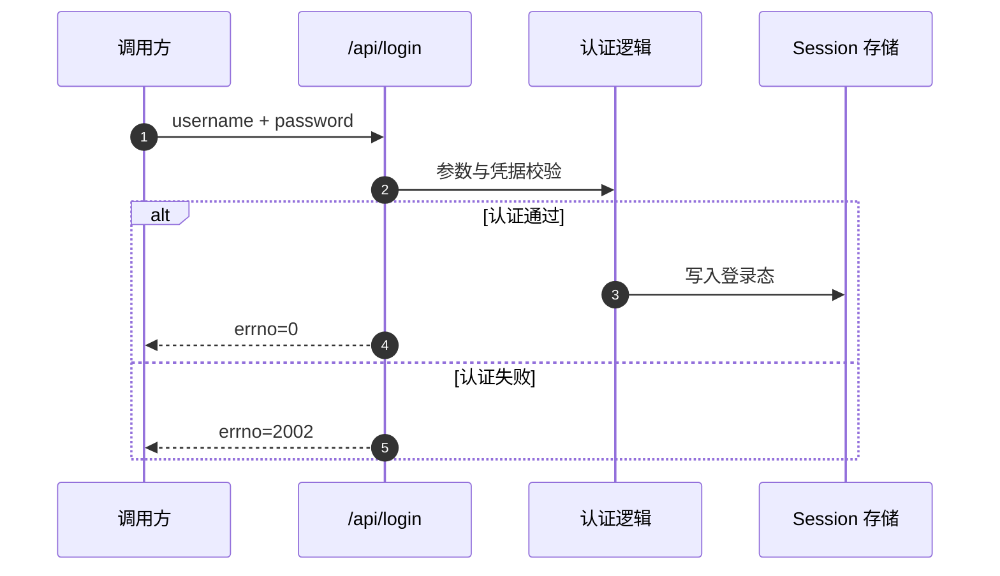
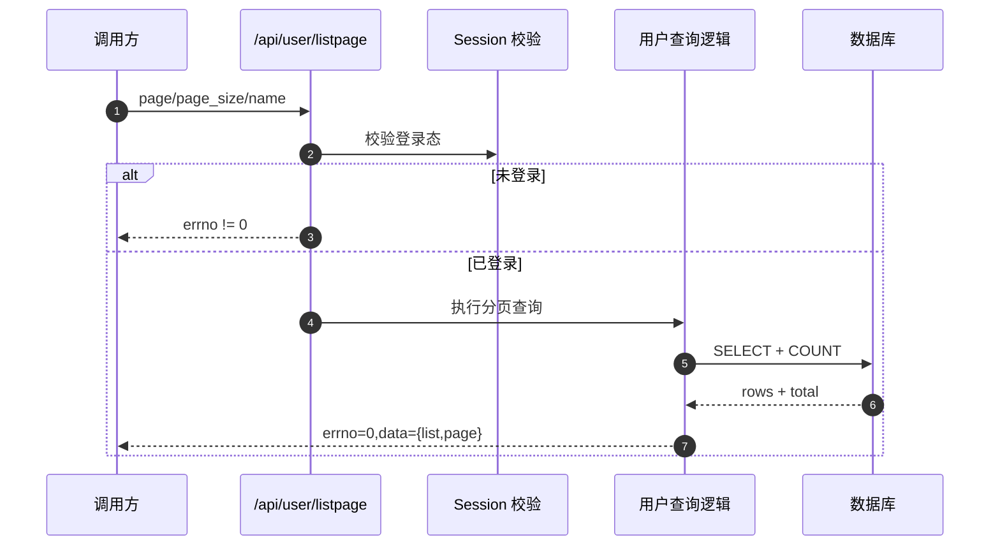

# gin_scaffold 对外架构文档

本文档面向外部接入方与合作团队，描述系统能力边界、接口约定、鉴权方式、错误模型与时序流程。

## 1. 文档范围

- 提供系统的对外能力说明
- 提供按路由分组的接口清单
- 提供接入时序图（Mermaid）
- 不包含内部代码实现细节和部署私有信息

## 2. 系统简介

`gin_scaffold` 是基于 HTTP 的服务端接口系统，提供：

- 登录/登出（会话态）
- 用户数据查询与维护
- 基础健康检查与接口文档访问

当前接口路径以实际路由为准（如 `/api/...`），未使用版本前缀（例如 `/api/v1`）。

## 3. 接入约定

### 3.1 协议与数据格式

- 传输协议：HTTP（生产建议使用 HTTPS）
- 请求/响应格式：`application/json`
- 字符编码：UTF-8

### 3.2 鉴权机制

- 鉴权方式：Session（Cookie）
- 登录成功后，服务端在会话中写入用户态
- 受保护接口需携带有效会话 Cookie

### 3.3 国际化参数

- 可选查询参数：`locale`
- 支持值：`zh`（默认）、`en`
- 作用：影响参数校验报错文案语言

## 4. 统一响应模型

所有接口均返回 JSON，通用结构如下：

```json
{
  "errno": 0,
  "errmsg": "",
  "data": {},
  "trace_id": "request-trace-id",
  "stack": ""
}
```

字段说明：

- `errno`：业务错误码（`0` 表示成功）
- `errmsg`：错误描述
- `data`：业务数据载荷
- `trace_id`：请求链路追踪 ID（用于排障）
- `stack`：调试栈信息（仅调试场景可能出现）

## 5. 接口清单（按路由分组）

## 5.1 公共接口

| 方法 | 路径 | 说明 | 鉴权 |
|---|---|---|---|
| GET | `/ping` | 健康检查 | 否 |
| GET | `/swagger/*any` | 在线 API 文档 | 否 |

## 5.2 认证接口（未登录可访问）

路由前缀：`/api`

| 方法 | 路径 | 说明 | 主要参数 | 鉴权 |
|---|---|---|---|---|
| POST | `/api/login` | 登录 | `username`, `password` | 否 |
| GET | `/api/loginout` | 退出登录 | 无 | 否 |

### `POST /api/login`

请求示例：

```json
{
  "username": "admin",
  "password": "123456"
}
```

成功响应：

```json
{
  "errno": 0,
  "errmsg": "",
  "data": "",
  "trace_id": "..."
}
```

失败示例：

```json
{
  "errno": 2002,
  "errmsg": "账号或密码错误",
  "data": "",
  "trace_id": "..."
}
```

## 5.3 用户接口（需登录）

路由前缀：`/api/user`

| 方法 | 路径 | 说明 | 主要参数 | 鉴权 |
|---|---|---|---|---|
| GET | `/api/user/listpage` | 用户分页查询 | `page`(必填), `page_size`, `name` | 是 |
| POST | `/api/user/add` | 新增用户 | `name`, `age`, `birth`, `addr`, `sex` | 是 |
| POST | `/api/user/edit` | 编辑用户 | `id`, `name`, `age`, `birth`, `addr`, `sex` | 是 |
| POST | `/api/user/remove` | 删除用户 | `ids`（逗号分隔） | 是 |
| POST | `/api/user/batchremove` | 批量删除用户 | `ids`（逗号分隔） | 是 |

`GET /api/user/listpage` 成功返回示例（结构）：

```json
{
  "errno": 0,
  "errmsg": "",
  "data": {
    "list": [],
    "page": 0
  },
  "trace_id": "..."
}
```

## 5.4 演示接口（测试用途）

路由前缀：`/demo`

> 该分组受 IP 白名单限制，主要用于演示，不建议作为正式业务接口依赖。

| 方法 | 路径 | 说明 | 鉴权 |
|---|---|---|---|
| GET | `/demo/index` | 基础响应演示 | IP 白名单 |
| ANY | `/demo/bind` | 参数绑定/校验演示 | IP 白名单 |
| GET | `/demo/dao` | 数据库访问演示 | IP 白名单 |
| GET | `/demo/redis` | Redis 访问演示 | IP 白名单 |

## 6. 错误码（当前可见）

| 错误码 | 含义 |
|---|---|
| 0 | 成功 |
| 401 | 非法请求/未授权类错误 |
| 500 | 内部错误（panic 或服务异常） |
| 2001 | 参数校验或输入错误 |
| 2002 | 业务处理失败（如登录失败、资源获取失败） |
| 2003 | 数据更新失败 |

> 备注：错误码语义可能随版本演进，接入方应以发布版本文档为准。

## 7. 时序图（Mermaid）

### 7.1 通用请求流程（受保护接口）



### 7.2 登录流程（`POST /api/login`）



### 7.3 用户分页查询（`GET /api/user/listpage`）



## 8. 兼容性与发布说明

- 当前接口无 URL 版本前缀，建议接入方通过文档版本管理兼容性
- 如需引入版本化路径（如 `/api/v2`），将在发布说明中提前公告
- 建议调用方在日志中记录 `trace_id` 以便双方联合排障
