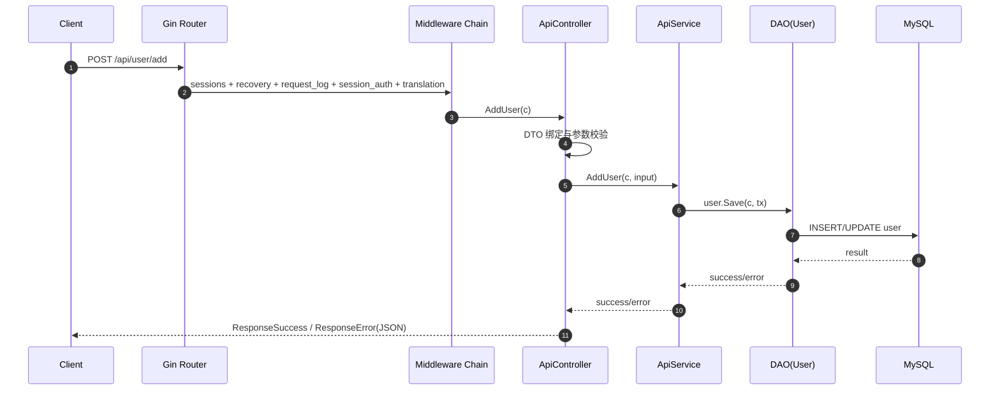
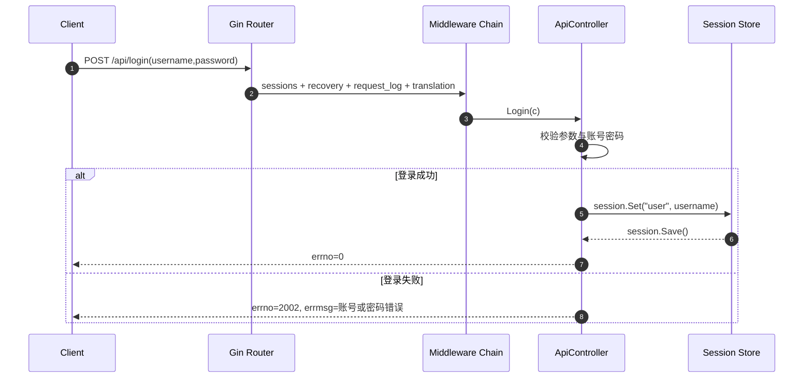
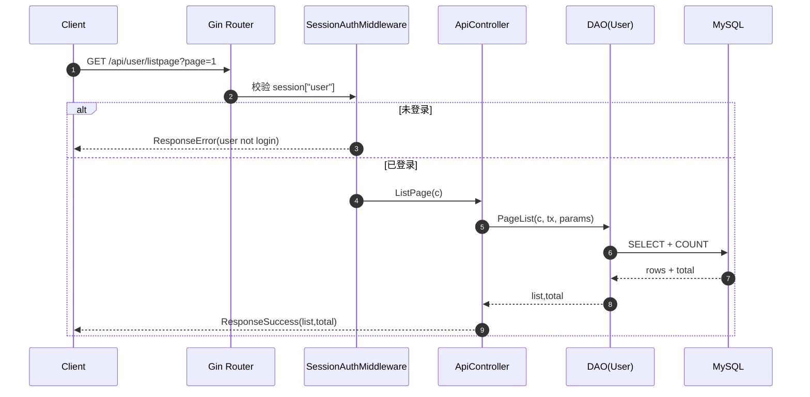

# gin_scaffold 设计文档

本文档基于当前仓库实现编写，覆盖系统架构、模块职责、接口清单（按路由分组）与时序图，便于开发、维护和扩展。

## 1. 项目概览

- 项目类型：Go + Gin Web API 脚手架
- 模块名：`github.com/e421083458/gin_scaffold`
- 进程入口：`main.go`
- 路由入口：`router/route.go`
- 运行配置：`conf/dev/*.toml`
- 主要能力：
  - 统一响应格式与错误码
  - 请求链路日志与 trace_id
  - 参数校验与中英文翻译
  - Session 鉴权
  - MySQL/Redis 集成
  - Swagger 文档

## 2. 分层与目录设计

```text
conf/           环境配置（base/mysql/redis）
controller/     控制器（参数绑定、调用服务、组织响应）
services/       业务服务层（业务逻辑编排）
dao/            数据访问层（GORM 模型与查询）
dto/            输入输出结构与参数校验绑定
middleware/     横切能力（日志、恢复、鉴权、翻译、响应）
public/         公共能力（trace 上下文与日志封装）
router/         路由注册与 HTTP Server 生命周期
docs/           Swagger 产物与架构文档
```

分层调用关系：

```text
HTTP Request
  -> Router + Middleware
  -> Controller
  -> Service（可选，当前部分逻辑仍在 Controller）
  -> DAO
  -> MySQL / Redis
  -> Response(JSON)
```

## 3. 启动与生命周期

### 3.1 启动流程（`main.go`）

1. `lib.InitModule("./conf/dev/", []string{"base","mysql","redis"})`
2. `router.HttpServerRun()` 启动 HTTP 服务
3. 监听系统信号（SIGKILL/SIGQUIT/SIGINT/SIGTERM）
4. `router.HttpServerStop()` 优雅关闭
5. `lib.Destroy()` 释放资源

### 3.2 HTTP 服务（`router/httpserver.go`）

- Gin 运行模式来源：`base.debug_mode`
- HTTP 监听地址：`base.http.addr`
- 读写超时：`base.http.read_timeout` / `base.http.write_timeout`
- Header 限制：`base.http.max_header_bytes`
- 关闭策略：`Shutdown(10s timeout)`

## 4. 核心模块设计

### 4.1 Router 层（`router/route.go`）

职责：
- 装配 Swagger 信息（title/desc/host/basePath）
- 注册路由分组
- 挂载中间件链

已注册基础路由：
- `GET /ping`
- `GET /swagger/*any`

### 4.2 Middleware 层（`middleware/*.go`）

- `RecoveryMiddleware`：捕获 panic，写日志并返回统一错误
- `RequestLog`：记录请求进入/输出日志，注入 `trace`
- `TranslationMiddleware`：注入 validator + translator（`zh`/`en`）
- `IPAuthMiddleware`：按 `base.http.allow_ip` 做白名单校验
- `SessionAuthMiddleware`：校验 session 中 `user` 登录态
- `ResponseSuccess/ResponseError`：统一 JSON 响应结构

统一响应结构：

```json
{
  "errno": 0,
  "errmsg": "",
  "data": {},
  "trace_id": "xxxx",
  "stack": ""
}
```

### 4.3 Controller / Service / DAO

- Controller：
  - `controller/demo.go`：演示绑定、DB/Redis 调用
  - `controller/api.go`：登录与用户 CRUD 接口
- Service：
  - `services/api.go`：`AddUser` 业务封装
- DAO：
  - `dao/demo.go`：`Area` 查询
  - `dao/user.go`：用户分页、查找、保存、删除

## 5. 配置设计

配置目录：`conf/dev/`

- `base.toml`
  - 基础：`debug_mode`、`time_location`
  - HTTP：`addr/read_timeout/write_timeout/max_header_bytes/allow_ip`
  - 日志：文件输出与级别
  - Swagger：`title/desc/host/base_path`
- `mysql_map.toml`
  - MySQL 连接池及 DSN（`list.default`）
- `redis_map.toml`
  - Redis 地址与连接参数（`list.default`）

## 6. 接口清单（按路由分组）

> 说明：以下为当前代码中实际注册路由；Swagger 注解中的 `BasePath /api/v1` 与实际注册路径存在差异，当前实际路径不带 `/v1`。

### 6.1 公共路由（Engine 根路由）

| 方法 | 路径 | 说明 | 处理函数 | 鉴权 |
|---|---|---|---|---|
| GET | `/ping` | 健康检查 | inline handler | 无 |
| GET | `/swagger/*any` | Swagger UI | ginSwagger handler | 无 |

### 6.2 Demo 分组（前缀 `/demo`）

分组中间件链：
`RecoveryMiddleware -> RequestLog -> IPAuthMiddleware -> TranslationMiddleware`

| 方法 | 路径 | 说明 | Controller |
|---|---|---|---|
| GET | `/demo/index` | 基础成功响应 | `DemoController.Index` |
| ANY | `/demo/bind` | 参数绑定与校验演示 | `DemoController.Bind` |
| GET | `/demo/dao` | MySQL 查询演示 | `DemoController.Dao` |
| GET | `/demo/redis` | Redis 读写演示 | `DemoController.Redis` |

### 6.3 API 未登录分组（前缀 `/api`）

分组中间件链：
`sessions.Sessions -> RecoveryMiddleware -> RequestLog -> TranslationMiddleware`

| 方法 | 路径 | 说明 | Controller |
|---|---|---|---|
| POST | `/api/login` | 登录，写入 session(user) | `ApiController.Login` |
| GET | `/api/loginout` | 退出登录，清理 session(user) | `ApiController.LoginOut` |

### 6.4 API 已登录分组（前缀 `/api`）

分组中间件链：
`sessions.Sessions -> RecoveryMiddleware -> RequestLog -> SessionAuthMiddleware -> TranslationMiddleware`

| 方法 | 路径 | 说明 | Controller |
|---|---|---|---|
| GET | `/api/user/listpage` | 用户分页列表 | `ApiController.ListPage` |
| POST | `/api/user/add` | 新增用户 | `ApiController.AddUser` |
| POST | `/api/user/edit` | 编辑用户 | `ApiController.EditUser` |
| POST | `/api/user/remove` | 删除用户（ids） | `ApiController.RemoveUser` |
| POST | `/api/user/batchremove` | 批量删除（当前同 remove 实现） | `ApiController.RemoveUser` |

## 7. 时序图（Mermaid）

### 7.1 通用请求处理时序（以 `/api/user/add` 为例）



### 7.2 登录流程时序（`/api/login`）



### 7.3 受保护接口鉴权时序（`/api/user/listpage`）



## 8. 现状与演进建议

1. 分层已形成，但部分业务仍在 Controller 直连 DAO，可逐步下沉到 Service。
2. 当前鉴权为 session + 固定账号密码示例，生产可替换为用户表/SSO/JWT。
3. 推荐补充自动化测试（当前仓库未见 `*_test.go`）。
4. `TranslationMiddleware` 每请求构建 validator/trans，后续可优化复用策略。

